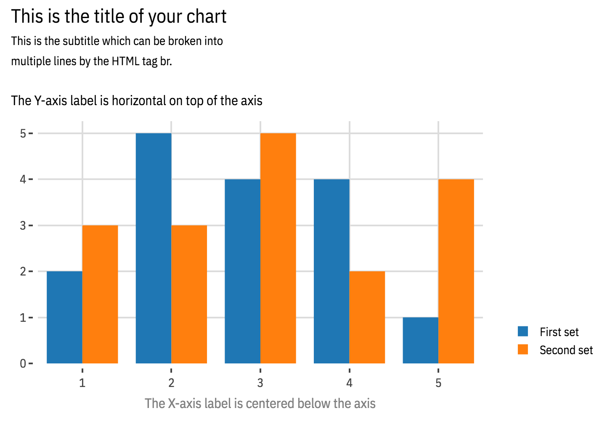

The following is a basic example on the usage of the helpers functions.

```
import plotly as py
import plotly.graph_objs as go
py.offline.init_notebook_mode(connected=True)

from plotly_layout import *

data = [
    go.Bar(
        x=[1, 2, 3, 4, 5],
        y=[2, 5, 4, 4, 1],
        name="First set"
    ),
    go.Bar(
        x=[1, 2, 3, 4, 5],
        y=[3, 3, 5, 2, 4],
        name="Second set"
    ),    
]

labels = dict(
    title="This is the title of your chart",
    subtitle="This is the subtitle which can be broken into<br>multiple lines by the HTML tag br.",
    ylabel="The Y-axis label is horizontal on top of the axis",
    xlabel="The X-axis label is centered below the axis")

# This is using IBM Plex, font that I particularly like. If you want
# to use it on the notebooks, you can just import it in your custom
# CSS.
layout = layout_by_line_height(
    font_family="IBM Plex Sans Condensed, sans-serif",
    **labels,
    xaxis=axis_no_title(),
    yaxis=axis_no_title(),
    legend=legend_dark())

fig = go.Figure(data=data, layout=layout)
py.offline.iplot(fig, show_link=False)
```

On a notebook, it should render as the following chart.


